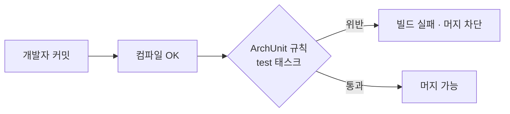
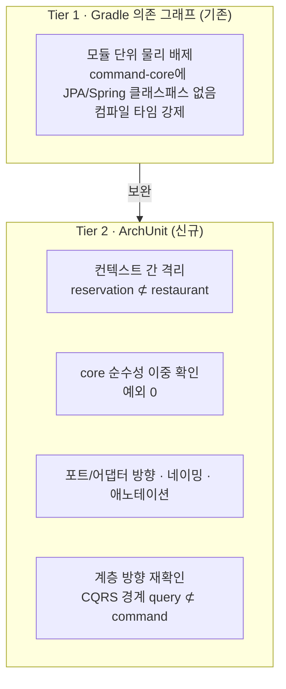
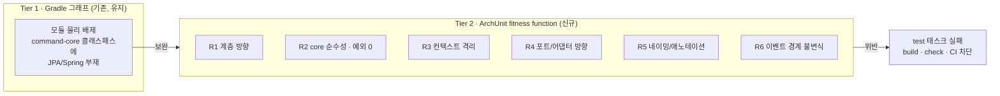

# RFC-031: 아키텍처 적합성 함수 — ArchUnit

- **상태**: 🌱 초안
- **사이클**: `20260604-v2-event-sourcing-cqrs`
- **범위**: v2 모듈 구조의 아키텍처 규칙을 사람 리뷰가 아닌 실행 가능한 테스트(fitness function)로 못 박는다. ArchUnit 채택 여부·역할·규칙 카탈로그·강제 시점을 결정.
- **선행 분석**: [[00-module-index]] §2 (의존성 매트릭스) · [[03-command-core]] §5.2 · [[DESIGN-002]] §4.4·§4.5 · [[DESIGN-019]]
- **계승**: V1엔 해당 없음 — 경계 검증이 부재했던 것이 이 RFC가 여는 문제다.

---

## 배경 (Background)

### 시나리오: `command-core`의 애그리거트에 누군가 `@Entity`를 붙인다

**V1에서는 이렇게 흐른다.**

한 개발자가 `Reservation` 애그리거트를 DB에 바로 저장하려고 `@jakarta.persistence.Entity`와 `@Column`을 붙인다. 컴파일된다. 테스트도 통과한다. 리뷰어가 diff에서 눈으로 잡지 못하면 그대로 머지된다. `core-module`이 JPA에 물들었다는 사실은 **아무도 강제로 막지 않는다**. 현재 경계는 오직 (a) Gradle `project(...)` 의존 wiring, (b) `adapter-module`의 `compileOnly(":core-module")` 트릭, (c) Detekt(스타일 전용, maxIssues:0) 뿐이고, 이 중 어느 것도 "core는 JPA를 몰라야 한다"거나 "`reservation` 컨텍스트는 `restaurant`를 직접 import하면 안 된다"를 **자동으로** 검사하지 않는다.

**ArchUnit(아키텍처 적합성 함수)에서는 이렇게 흐른다.**

1. `command-core`에 Spring/JPA/jakarta 심볼이 등장하는 순간, `test` 태스크의 ArchUnit 규칙이 위반을 잡는다.
2. `./gradlew build`(및 CI)가 **빨간불**로 실패한다 — 위반 클래스·위반 대상이 메시지로 출력된다.
3. 머지 불가. 아키텍처 규칙이 "문서상의 약속"이 아니라 "깨지면 빌드가 죽는 계약"이 된다.

### 핵심 개념: 적합성 함수(fitness function)란

"아키텍처 적합성 함수"는 아키텍처 특성(경계·의존 방향·순수성)을 **자동으로 검증하는 실행 가능한 테스트**다. 사람의 코드 리뷰는 놓치고, 시간이 지나면 침식된다(architecture erosion). 적합성 함수는 규칙을 코드로 고정해 침식을 **빌드 실패로** 되돌린다.

| 개념 | 현행(V1) | 변경(V2) | 한 줄 정의 |
|------|----------|----------|-----------|
| 모듈 경계 강제 | Gradle 의존 그래프 + `compileOnly` 트릭 | Gradle 그래프(유지) + **ArchUnit(신규)** | 물리 배제 + 논리 규칙 이중 방어 |
| 컨텍스트 간 참조 금지 | 없음 (같은 모듈 안이라 Gradle 무력) | ArchUnit slices 규칙 | `reservation ⊄ restaurant` 를 빌드가 강제 |
| core 순수성 | 관례·리뷰 의존 | ArchUnit 규칙, **예외 0** | JPA/Spring import 시 빌드 실패 |
| 네이밍·애노테이션 규율 | Detekt 일부(ClassNaming) | ArchUnit 규칙으로 계층별 확장 | `@Entity`는 infra에만, 컨트롤러는 `Controller` 접미사 |

---

## 맥락 (Context)

- **자동화된 경계 검증이 V1에 전무하다.** 계층 방향은 Gradle wiring이 물리적으로만 막는다. 같은 모듈 **안**에서 벌어지는 위반 — 컨텍스트 간 직접 import, 도메인 서비스에 Spring 애노테이션, 순수성 침식 — 은 어떤 도구도 검사하지 않는다 → V2가 command 서브모듈 4층 + CQRS 경계로 복잡해지면 리뷰만으로는 침식을 못 막는다.
- **V2 설계 문서가 이미 ArchUnit을 전제로 쓰였다.** [[03-command-core]] §5.2는 "컨텍스트 간 참조 금지는 서브모듈로 못 막으므로 ArchUnit/Konsist로 강제, 위반 시 빌드 실패"를, §6은 이를 명시적 과제로 올려두었다 → **결정이 문서에 흩어져 있고 비준되지 않았다.** 이 RFC가 그것을 닫는다.
- **모듈 단위 순수성은 이미 Gradle 그래프가 담당한다.** [[03-command-core]] §2는 "build.gradle.kts에서 JPA/Spring 의존성 물리적 배제 → 컴파일 타임 강제(ArchUnit 아님, Gradle 그래프)"라고 못 박았다 → ArchUnit이 **모듈 물리 배제를 대체하려는 게 아니다.** 역할 분담이 이 RFC의 핵심 논점이다.
- **자산: 규칙의 단일 진실 원천이 이미 있다.** [[00-module-index]] §2 의존성 매트릭스와 핵심 불변식([[DESIGN-019]]), [[DESIGN-002]] §4.4·§4.5가 "무엇이 허용/금지인가"를 이미 표로 확정했다 → ArchUnit 규칙은 새 정책을 발명하는 게 아니라 **이 표를 기계가 읽는 테스트로 번역**하는 일이다.

**핵심 긴장:** 물리적으로 못 막는 논리 규칙(모듈 내부 컨텍스트 격리·네이밍·순수성 이중 확인)을, Gradle 그래프를 대체하지 않으면서, greenfield인 V2에 **언제·어디서·얼마나 엄격하게** 걸 것인가.

---

## Goal / Non-goal

**Goal**
- V2 모듈 구조([[00-module-index]] §2)의 아키텍처 규칙을 실행 가능한 ArchUnit 테스트로 고정하고, 위반 시 빌드/CI 실패로 강제.
- Gradle 의존 그래프(Tier 1)와 ArchUnit(Tier 2)의 **역할 경계**를 명문화.
- 검증 대상을 **V2 command/query 모듈**로 한정하고, 규칙 카탈로그(R1~R6)와 강제 시점을 확정.

**Non-goal (이번에 하지 않음)**
- **V1 현행 7모듈 코드에 소급 적용하지 않는다.** V2 모듈이 실제로 생기는 Phase 7부터 강제한다.
- 개별 규칙의 최종 Kotlin/DSL 구현 세부는 후속 design_doc에 위임(이 RFC는 규칙의 의도·범위·강제 정책만).
- Detekt·Spotless 기존 정적분석의 대체가 아니다 — ArchUnit은 아키텍처 규칙에 국한, 스타일은 기존 도구 유지.

---

## 논의 (Discussion)

### 논점 1. ArchUnit인가 Konsist인가 → [[ADR-아키텍처-적합성-도구]] (번호 미정)

**맥락에서 나온 질문.** [[03-command-core]] §5.2가 "ArchUnit/Konsist"를 병기했다. 순수 Kotlin 프로젝트에서 어느 도구로 적합성 함수를 쓸 것인가.

검토한 선택지:
- **ArchUnit** — JVM 바이트코드 분석. 성숙한 `LayeredArchitecture`/`slices` API, `FreezingArchRule`(위반 baseline) 지원, JUnit5 연동. 컴파일된 실제 의존(코틀린 합성 접근자 포함)을 본다. 단점: 바이트코드라 top-level function·typealias 등 소스 레벨 구성엔 약함.
- **Konsist** — Kotlin 소스(PSI) 분석. Kotlin-native, 선언 그대로(top-level function·확장함수) 검사, 가독성 좋음. 단점: 상대적으로 신생, 레이어드 아키텍처 표현력이 ArchUnit보다 얕고 생태계·레퍼런스가 적음.

**내 의견(AI):** **ArchUnit** 권장. 이유: (a) 규칙 카탈로그의 핵심이 계층 방향(R1)·순수성(R2)·slices 격리(R3)인데 이는 ArchUnit이 가장 강한 영역이다. (b) 바이트코드 기준이라 "코틀린이 실제로 컴파일한 의존"을 포착 — 소스엔 안 보여도 컴파일 결과 새는 의존을 잡는다. (c) 점진 도입이 필요할 때 `FreezingArchRule` 안전판이 있다. 인정하는 트레이드오프: 바이트코드라 네이밍/선언 규칙 일부(R5)는 소스 관점의 Detekt와 **분담**하는 게 낫다 — ArchUnit이 클래스 레벨 네이밍·애노테이션을 맡고, top-level function 규율이 필요하면 Detekt/Konsist를 보조로.

**네 결정:** ArchUnit 채택. 〔근거 확인/보강 필요〕

**결론:** 적합성 함수 도구로 **ArchUnit(`archunit-junit5`)** 을 채택. Konsist는 top-level 선언 규율이 필요해질 경우의 보조 후보로 열어둔다.

### 논점 2. ArchUnit과 Gradle 그래프의 역할 분담 → [[ADR-적합성-2tier]] (번호 미정)

**맥락에서 나온 질문.** [[03-command-core]] §2는 모듈 순수성을 Gradle 그래프가 담당한다고 이미 규정했다. 그렇다면 ArchUnit은 정확히 무엇을 맡고, 무엇을 중복 검증하는가.

검토한 선택지:
- **A. ArchUnit이 모든 걸(모듈 방향 포함) 담당** — Gradle 의존을 느슨하게 두고 ArchUnit으로 전부 강제. 단점: 물리 배제를 포기하면 IDE 자동완성·클래스패스에 금지 심볼이 노출됨. §2 원칙 위배.
- **B. Gradle=물리 배제 / ArchUnit=논리 규칙만, 중복 없음** — ArchUnit은 Gradle이 못 하는 것(컨텍스트 격리·네이밍·순수성 이중)만. 단점: 계층 방향 규칙이 문서화된 테스트로 남지 않음.
- **C. 2-tier, 일부 의도적 중복** — Gradle이 물리 배제(1차), ArchUnit이 논리 규칙 + 계층 방향을 **문서화된 fitness function으로 재확인**(2차).

**내 의견(AI):** **C(2-tier, 의도적 중복)** 권장. Gradle 그래프는 [[03-command-core]] §2대로 물리 배제의 1차 방어선으로 유지한다. ArchUnit은 (1) Gradle이 **표현 불가능한** 모듈 내부 규칙(컨텍스트 격리 R3, 네이밍 R5, 애노테이션 배치)을 담당하고, (2) 계층 방향(R1)·순수성(R2)은 Gradle과 **중복이더라도** 실행 가능한 문서로 재확인한다. 중복 비용은 거의 0(규칙 몇 줄)인 반면, 아키텍처 계약이 "읽을 수 있고 깨지면 실패하는 테스트"로 남는 값어치가 크다.

**네 결정:** 2-tier 채택 — Gradle 물리 배제 유지 + ArchUnit 논리 규칙. 〔근거 확인/보강 필요〕

**결론:** **2-tier 강제.** Tier 1(Gradle) = 모듈 물리 배제(유지). Tier 2(ArchUnit) = 모듈 내부 논리 규칙 + 계층/순수성 재확인. ArchUnit은 Gradle을 대체하지 않고 보완한다.

### 논점 3. 규칙을 어디서 실행하나 (테스트 배치) → [[ADR-적합성-실행위치]] (번호 미정)

**맥락에서 나온 질문.** 규칙 중 R1(계층 방향)·CQRS 경계는 여러 모듈을 동시에 봐야 하고, R2·R3·R5는 단일 모듈만 보면 된다. ArchUnit은 검사 대상 클래스가 test 클래스패스에 있어야 한다. 조사 결과 이 프로젝트는 테스트 의존을 모듈별로 개별 선언한다(루트 `subprojects{}`는 플러그인·Test 태스크만 설정) → 배선 위치가 실제 결정 사항이다.

검토한 선택지:
- **A. 전용 `architecture-test` 모듈** — 모든 V2 모듈을 `testImplementation`으로 끌어와 전 시스템 규칙(R1·CQRS 경계)을 한 곳에서 실행. 모듈 내부 규칙도 여기 몰 수 있음.
- **B. 각 모듈 자체 테스트** — R2·R3·R5를 해당 모듈 test에서. 전 시스템 규칙은 최광역 가시성 모듈(command-adapter)에서.
- **C. 혼합** — 전 시스템 규칙 = 전용 모듈(또는 command-adapter), 모듈 내부 규칙 = 각 모듈.

**내 의견(AI):** **C(혼합)** 권장. 컨텍스트 격리(R3)·순수성(R2)·네이밍(R5)은 **각 모듈 자체 test**에 두는 게 자연스럽다(그 모듈만 클래스패스에 있으면 됨, 실패도 해당 모듈에서 남). 전 시스템 규칙(R1 계층 방향, `query ⊄ command-*` CQRS 경계)은 **전용 `architecture-test` 모듈**에서 실행 — command/query가 런타임에 별도 서버로 쪼개지므로([[00-module-index]] §0의 07/08 분리) 전 모듈을 한눈에 보는 지점이 필요하다. 배선: `gradle/libs.versions.toml`에 `archunit-junit5` 항목 추가 + 테스트 번들(`testing-archunit`) 신설, 필요한 모듈에서 `testImplementation(libs.bundles.testing.archunit)`.

**네 결정:** 혼합 — 내부 규칙은 각 모듈, 전 시스템 규칙은 전용 모듈. 〔근거 확인/보강 필요〕

**결론:** 모듈 내부 규칙(R2·R3·R5)은 각 모듈 test, 전 시스템 규칙(R1·CQRS 경계)은 전용 `architecture-test` 모듈. `libs.versions.toml`에 `archunit-junit5` + `testing-archunit` 번들 추가.

### 논점 4. core 순수성의 예외 정책 → [[ADR-core-순수성-예외0]] (번호 미정)

**맥락에서 나온 질문.** [[03-command-core]] §2·§3이 command-core의 프레임워크 의존 0을 지향한다. 그런데 V1 `core-module`엔 이미 순수성 위반 2건이 있다 — `BidirectionalEncryptProperties`(`@ConfigurationProperties`), `MenuIdIsNotEmptyValidationPolicy`(Spring `StringUtils`). V2 규칙에서 이를 어떻게 다루나.

검토한 선택지:
- **A. allowlist로 면제** — 규칙에 예외 등록, 기술부채로 문서화. 즉시 통과. 단점: "예외 0" 원칙에 구멍.
- **B. freeze(baseline)** — 현재 위반을 store에 기록, 신규 위반만 실패. 단점: 위반이 store에 잔존.
- **C. 마이그레이션 시 제거 후 예외 0 규칙** — properties를 core 밖으로, `StringUtils`를 kotlin 표준(`String.isNullOrBlank()` 등)으로 교체한 뒤, 예외 없는 순수 규칙 적용.

**내 의견(AI):** **C(제거 후 예외 0)** 권장. 검증 대상이 V2 greenfield 모듈이므로(논점 5), V1 impurity를 command-core로 **그대로 이관하지 않는 것**이 마이그레이션의 정상 경로다. `@ConfigurationProperties` 바인딩은 도메인이 아니라 인프라 관심사이므로 command-infrastructure/adapter로 옮기고, `StringUtils.hasText`류는 Kotlin 표준 확장으로 대체하면 core는 진짜 순수해진다. allowlist는 "일단 통과"의 유혹을 남기므로 피한다.

**네 결정:** 예외 0. allowlist·freeze 안 씀. V1 impurity 2건은 마이그레이션 시 제거. 〔근거 확인/보강 필요〕

**결론:** command-core 순수성 규칙(R2)은 **예외 없음**. V1의 순수성 위반 2건은 면제 대상이 아니라 마이그레이션 시 제거할 안티패턴으로 명시한다.

### 논점 5. 점진 도입(freeze) vs 처음부터 엄격 → [[ADR-적합성-도입강도]] (번호 미정)

**맥락에서 나온 질문.** ArchUnit은 기존 위반을 baseline으로 얼리는 `FreezingArchRule`을 제공한다. V2에 이걸 쓸 것인가.

검토한 선택지:
- **A. freeze로 점진 도입** — 초기 위반을 baseline 처리, 신규만 실패. 레거시에 소급할 때 유용.
- **B. 처음부터 strict** — 예외·baseline 없이 첫날부터 전 규칙 강제.

**내 의견(AI):** **B(처음부터 strict)** 권장. 검증 대상이 V2 **신규(greenfield)** command/query 모듈이라 얼릴 레거시 위반이 애초에 없다(논점 4에서 impurity도 이관 안 함). freeze는 소급 도입의 안전판인데 우리는 소급하지 않으므로 불필요하다. 처음부터 깨끗하게 강제하는 편이 침식 방지에 정직하다. (대조: 만약 V1 코드에 소급했다면 freeze가 현실적 선택이었을 것.)

**네 결정:** 처음부터 strict. freeze 미사용. 〔근거 확인/보강 필요〕

**결론:** V2 greenfield 특성상 **처음부터 strict** 적용. `FreezingArchRule`은 쓰지 않는다.

### 논점 6. 강제 시점과 CI 게이트 → [[ADR-적합성-CI게이트]] (번호 미정)

**맥락에서 나온 질문.** 규칙은 언제부터, 어느 파이프라인 단계에서 강제되나. 조사 결과 기존 `gitPreCommitHook`은 spotless+detekt만 돌리고 **테스트는 돌리지 않는다**.

**내 의견(AI):** ArchUnit 규칙은 `test` 태스크에 속하므로 **`./gradlew build`·`check`·CI에서 강제**된다. 강제 시작 시점은 각 V2 모듈이 실제로 생기는 **Phase 7**(모듈별: command-core=7-2, application=7-3, adapter/infra=7-4, query=7-5)이다 — 모듈이 생기는 즉시 그 모듈의 규칙을 켠다. 명시할 간극: `gitPreCommitHook`은 테스트 미실행이라 **로컬 pre-commit에선 위반이 안 걸린다** → CI가 실질 방어선이다. 원한다면 pre-commit에 arch 규칙만 빠르게 도는 별도 태스크를 추가하는 것도 선택지지만, 훅 시간 증가 트레이드오프가 있어 기본은 CI 게이트로 둔다.

**네 결정:** CI 게이트를 실질 방어선으로, Phase 7 모듈별 점진 강제. 〔근거 확인/보강 필요〕

**결론:** `test` 태스크로 `build`/`check`/CI에서 강제. Phase 7에서 모듈이 생기는 대로 규칙을 켠다. `gitPreCommitHook`이 테스트 미실행이라는 간극을 문서에 명시하고, CI를 실질 게이트로 삼는다.

---

## 결정 요약

| # | 결정 | ADR |
|---|------|-----|
| 1 | 적합성 함수 도구로 ArchUnit(`archunit-junit5`) 채택, Konsist는 보조 후보 | [[ADR-아키텍처-적합성-도구]] (미정) |
| 2 | 2-tier 강제 — Gradle=물리 배제(유지), ArchUnit=논리 규칙 + 재확인 | [[ADR-적합성-2tier]] (미정) |
| 3 | 내부 규칙=각 모듈 test, 전 시스템 규칙=전용 `architecture-test` 모듈 | [[ADR-적합성-실행위치]] (미정) |
| 4 | core 순수성 예외 0, V1 impurity 2건은 마이그레이션 시 제거 | [[ADR-core-순수성-예외0]] (미정) |
| 5 | V2 greenfield → 처음부터 strict, freeze 미사용 | [[ADR-적합성-도입강도]] (미정) |
| 6 | `test`/CI 강제, Phase 7 모듈별 점진 적용, pre-commit 간극 명시 | [[ADR-적합성-CI게이트]] (미정) |

> ADR 번호는 RFC 종결 시 [[ADR-INDEX]] 순서에 따라 부여한다(현행 최신 [[ADR-024]]). 규칙별 최종 DSL 구현 세부는 후속 design_doc에 위임.

### 규칙 카탈로그 (강제 대상)

[[00-module-index]] §2 의존성 매트릭스 · [[03-command-core]] §5.2 · 네이밍 관례에서 직접 도출:

| ID | 규칙 | 근거 | ArchUnit 표현 |
|----|------|------|---------------|
| **R1 계층 방향** | `command-application → command-core/contract/shared`만; `command-infrastructure ⊄ command-core`(핵심 불변식); `query ⊄ command-*` 전면 금지 | [[00-module-index]] §2 매트릭스·불변식 | `layeredArchitecture()` / `noClasses().should().dependOnClassesThat()` |
| **R2 core 순수성** | `command.core..`는 `kotlin..`/`java..`/`shared..`만 접근. Spring·JPA·jakarta·contract import 0. **예외 없음** | [[03-command-core]] §2·§3 | `noClasses().that().resideInAPackage("..command.core..").should().dependOnClassesThat().resideInAnyPackage("org.springframework..", "jakarta..", ...)` |
| **R3 컨텍스트 격리** | `command.core.reservation..` ⊄ 형제 컨텍스트(`restaurant`·`menu`·…) 직접 import | [[03-command-core]] §5.2 · [[DESIGN-002]] §4.5 | `slices().matching("..command.core.(*)..").should().notDependOnEachOther()` |
| **R4 포트/어댑터 방향** | output-port 구현체는 command-infrastructure(또는 adapter)에만; use case 구현은 `..port.input..` 인터페이스 구현 | [[04-command-application]] · [[05-command-adapter]] | residesIn + `implement` |
| **R5 네이밍/애노테이션** | 컨트롤러=`@RestController`+`Controller`; use case impl=`@UseCase`+`Service`+`..usecase..`; JPA 엔티티=`@Entity`+`Entity`+`persistence..entity..`; 도메인 서비스=`DomainService`+core `..service..`(Spring 애노테이션 0) | 네이밍 관례 | `classes().that().areAnnotatedWith().should().haveSimpleNameEndingWith()/resideInAPackage()` |
| **R6 이벤트 경계 불변식** | command-core 애그리거트의 `DomainEvent`는 core 자체 타입 — core ⊄ contract(통합 이벤트). 번역은 command-application만 | [[03-command-core]] §2 함의 · [[DESIGN-019]] | R2에 contract 금지 포함 + core→contract 부재 검증 |

상세 규칙 구현·엣지케이스(패키지 네이밍 흔들림 `policy/format`↔`form`↔`formats` 등)는 후속 design_doc 참조.

---

## 결과 (목표 아키텍처 요약)

- 아키텍처 규칙이 문서상 약속이 아니라 **깨지면 빌드가 실패하는 계약**이 된다.
- Gradle 그래프(물리)와 ArchUnit(논리)이 2-tier로 이중 방어하며, ArchUnit은 Gradle이 못 막는 모듈 내부·CQRS 경계를 감시한다.
- V2 greenfield 모듈에 Phase 7부터 strict(예외·freeze 없이) 적용, CI가 실질 게이트.

상세 모듈 트리·의존성 매트릭스는 [[00-module-index]], 강제 시점 순서는 [[00-roadmap]] Phase 7 참조.

---

## 관련 문서
- 분석: [[00-module-index]] §2 · [[03-command-core]] §5.2·§6
- 근거: [[DESIGN-002]] §4.4·§4.5 · [[DESIGN-019]] (이벤트 실행 계층 불변식)
- ADR: 논점 1~6 대응 신규 ADR (RFC 종결 시 [[ADR-INDEX]]에 부여)
- 설계: 규칙별 DSL 구현 후속 design_doc (작성 시 링크 추가)
- 프로세스: [[RFC-009-testing-quality-gates]] (테스트·품질 게이트 — 적합성 함수는 그 하위 확장) · [[RFC-010-module-structure-migration]] (모듈 구조 확정)
