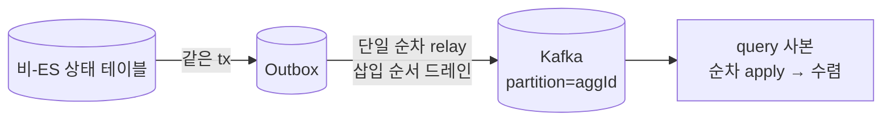

# RFC-032 — 비-ES 상태 사본의 재정렬 처리 (단일 순차 relay가 봉합 — 별도 순서 토큰 불요)

- **상태**: 🏷 합의 (2026-07-22) — produce 재정렬의 유일한 발생 지점(relay→produce)을 단일 순차 relay([[RFC-025-ordering-relay-dlq-reconciliation]])가 ES/비-ES 공통으로 봉합한다. 비-ES 전용 순서 토큰을 신설하지 않는다.
- **사이클**: `20260612-v2-cqrs-es-architecture`
- **범위**: schedule·user·menu·category·company(비-ES) 상태가 query DB 사본으로 흘러갈 때, 장애 창의 이벤트 재정렬을 어떻게 흡수하는지 결정한다.
- **선행 분석**: [[12-non-es-outbox-ordering]] · [[11-data-schema-contract-conformance]] §1
- **선행 RFC**: [[RFC-025-ordering-relay-dlq-reconciliation]](단일 순차 relay · ES 재정렬=LWW seq 가드) · [[RFC-021-event-identity-and-global-ordering]](비-ES는 event_id만, seq 없음) · [[RFC-030-read-freshness-command-response-contract]](비-ES=bounded staleness) · [[RFC-014-aggregate-concurrency-control]](동시성 — 비관 락/DB 행 락)
- **닫으면**: [[01-command-schema]] §1.3 정정(비-ES `sequence_no` 기정사실화 철회) + [[11-data-schema-contract-conformance]] §1 종결

---

## 배경 (Background)

### 시나리오: 메뉴 이름이 A→B→C로 바뀌었는데 사본엔 B가 남는다

`menu`는 비-ES 컨텍스트(상태 테이블 + Outbox)다. command/query DB가 물리 분리라([[ADR-013-db-hosting-and-read-write-topology]]) 예약 상세 화면이 쓸 메뉴명은 query DB의 로컬 사본(`MenuView`)으로 복제된다([[02-query-schema]] §3).

1. `menu`가 이름을 B→C로 두 번 바꾸며 `MenuRenamed("B")`, `MenuRenamed("C")`를 Outbox에 쌓는다.
2. relay가 Kafka로 발행한다. 파티션 키 = `aggregate_id`([[RFC-021-event-identity-and-global-ordering]]).
3. query 컨슈머가 받아 `MenuView`를 upsert한다.

정상 흐름에선 Kafka가 같은 파티션에서 순서를 지킨다. 걱정거리는 "장애 창에서 C가 먼저 적용되고 늦은 B가 덮으면 사본이 틀린 값 B를 계속 든다"는 재정렬이다. 비-ES에는 ES의 `sequence_no` 같은 애그리거트별 순서 토큰이 없어([[RFC-021-event-identity-and-global-ordering]] §54) LWW 가드가 비교할 값이 없다 — 이게 원래 걸렸던 지점이다.

## 재정렬이 실제로 어디서 나나 (봉합 지점)

발행 파이프라인에서 순서가 확정되는 곳과 뒤집힐 수 있는 곳은 갈린다.

| 단계 | 역전? |
|------|------|
| 상태 테이블 write + Outbox insert (같은 tx) | 확정 — 삽입 순서로 못 박힘 |
| **relay → Kafka produce** | **★ 여기서만** |
| Kafka 파티션 저장·소비 | 없음 — 파티션 내 append=read 순서 보장 |
| 컨슈머 순차 apply | 없음(순차 apply 전제) |

`relay → produce`에서 순서가 뒤집히는 경우는 셋뿐이고, 전부 **"하나의 순서 있는 프로듀서가 하나의 안정된 파티션에 쓴다"는 계약이 깨질 때**다.

- **프로듀서 재시도 역전** → `enable.idempotence=true`([[DESIGN-020-ordering-and-failure-handling]] §2)로 닫힘.
- **relay 병렬 발행** → [[RFC-025-ordering-relay-dlq-reconciliation]] 결정 1의 **단일 순차 relay**가 outbox를 삽입 순서로 단독 드레인해 닫힘. 페일오버 시에도 relay 작업 자체가 DB 트랜잭션에 묶여 있어(outbox 행 락), 두 인스턴스가 겹쳐도 재발행은 at-least-once 중복이 될 뿐 순서를 뒤집지 못한다 — 중복은 `event_id` dedup([[RFC-021-event-identity-and-global-ordering]])이 흡수.
- **repartition** → 파티션 수를 동결하면 발생하지 않는다(운영 정책).

즉 produce 재정렬은 **비-ES 전용 장치가 아니라 이미 결정된 배송 계약(단일 순차 relay + idempotent producer + partition=`aggregate_id` + 파티션 동결 + 순차 apply)이 ES·비-ES 공통으로 닫는다.** ES가 `sequence_no`를 갖는 것과 무관하게, 순서를 지키는 것은 relay의 단일 직렬화지 사본별 토큰이 아니다.

## 결정 (Decision)

| # | 결정 |
|---|------|
| 1 | **비-ES 전용 순서 토큰(`version` 등)을 재정렬 목적으로 신설하지 않는다.** produce 재정렬은 단일 순차 relay(RFC-025)가 ES/비-ES 공통으로 봉합하므로, 비-ES 사본에 추가 순서 토큰이 필요 없다. |
| 2 | 데이터 문서 [[01-command-schema]] §1.3의 비-ES `outbox.sequence_no` = "event_store와 동일 계열" 기정사실화를 **철회**한다. `sequence_no`는 ES 이벤트의 애그리거트 내 순번일 뿐, 비-ES 행의 발행 순서 키가 아니다 — 발행 순서는 단일 순차 relay의 삽입 순서 드레인이 보장한다([[11-data-schema-contract-conformance]] §1 종결). |
| 3 | **잔여 — dedup 보존창 밖 stale 재전달**(inbox가 `event_id`를 GC한 뒤 아주 늦은 중복이 새 값을 덮는 경우)은 무트래픽 프로토타입 스코프 밖으로 둔다. 발생하면 event_store/상태 재구축([[RFC-011-projection-rebuild-catchup]])으로 자가치유. 실측으로 실제 문제가 드러나면 그때 가드를 도입한다. |
| 4 | `version` 컬럼은 **이 RFC가 도입하지 않는다.** 동시성 결정([[RFC-014-aggregate-concurrency-control]])은 ES=비관 락, 비-ES="V1과 동일하게 DB 행 락"이라 `@Version` 낙관락 컬럼이 결정된 바 없다. 만약 RFC-014 비-ES 조항이 이후 `@Version`을 택하면, 그 컬럼이 애그리거트별 단조라 결정 3의 가드가 필요해질 때 부산물 토큰으로 재사용 가능하다 — 그 활성화는 지금 불요. |

## 결과

- **정상·클린 페일오버**: 단일 순차 relay + idempotent producer + partition=`aggregate_id`가 순서를 지킨다. 별도 토큰 불요.
- **중복**: `event_id` dedup이 흡수.
- **freshness**: 비-ES는 여전히 bounded staleness([[RFC-030-read-freshness-command-response-contract]]).

## 관련 문서
- 분석: [[12-non-es-outbox-ordering]] · [[11-data-schema-contract-conformance]] §1
- 선행/이웃 RFC: [[RFC-025-ordering-relay-dlq-reconciliation]] · [[RFC-021-event-identity-and-global-ordering]] · [[RFC-030-read-freshness-command-response-contract]] · [[RFC-014-aggregate-concurrency-control]]
- 데이터: [[01-command-schema]] §1.3 · [[02-query-schema]] §3
- 설계: [[DESIGN-020-ordering-and-failure-handling]] · [[DESIGN-004-read-model]] §4.2 · [[ADR-013-db-hosting-and-read-write-topology]]
- 인덱스: [[RFC-INDEX]]
